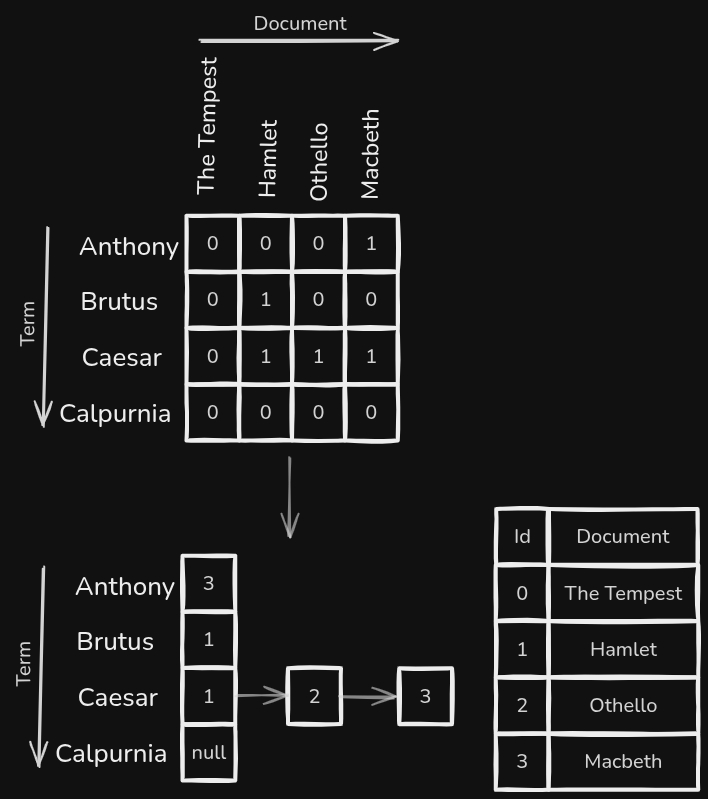

<p align="center">
    <a href="https://www.graalvm.org/">
        
    </a>
    <br />
    <a href="https://maven.apache.org/">
        
    </a>
</p>

# Inverted Index
This repository contains an implementation of a simple Inverted Index.

## 1) Overview
> What is an Inverted Index?

Previously, we explored the following questions about [incidence matrices](https://github.com/kaonashi-noface/incidence-matrix?tab=readme-ov-file#1-overview):
* what is it?
* why is it important?
* how to create one?

We also alluded to the concept of a `postings list` covering one of its flaws - ineffective memory management.

A `postings list` is a similar to a row in an incidence matrix - it marks all documents that contain a given term.

The difference between:
1) a row associated with a term in an incidence matrix
2) a postings list associated with a term in an inverted index

is that a postings list only tracks the documents that contain the term of interest. On the other hand, an inverted index tracks the absence (`0`s in a cell) of a term.

For example, the following incidence matrix can be represented as an inverted index:


`"Caesar": 1 -> 2 -> 3` represents a postings list where the term `Caesar` was found in documents 1, 2 and 3.

## 2) Terminologies
TODO

# High Level Design
## 1) Problem Statement
The goal of this repository is to create a simple Inverted Index that is capable of:
* TODO

## 2) Constraints
This inverted index implementation will not:
* TODO

## 3) Implementation
TODO

# Prerequisites
This project requires the following:
* SDKMAN
* Java Runtime
* Maven

# Installation
Follow the instructions below to install SDKMAN:
```
https://sdkman.io/install
```

Run the following command to install the exact Java Graal version:
```bash
sdk env install
```

Run the following command to install the exact Maven Version:
```bash
sdk install maven 3.9.9
```

# Build
Run the following command to clean install dependencies:
```shell
mvn clean install
```

Run the following command to run unit tests via terminal:
```shell
mvn test
```

Run the following command to query the inverted index via Maven + terminal:
```shell
mvn exec:java -Dexec.mainClass="com.search.App"
```

Run the following command to query the inverted index via terminal:
```shell
java -cp target/incidence-matrix-1.0-SNAPSHOT.jar com.search.App
```

# License
[](./LICENSE)